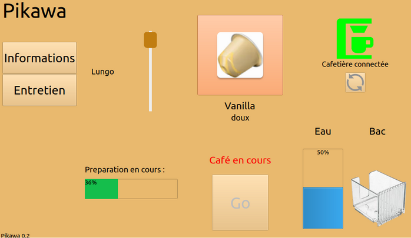
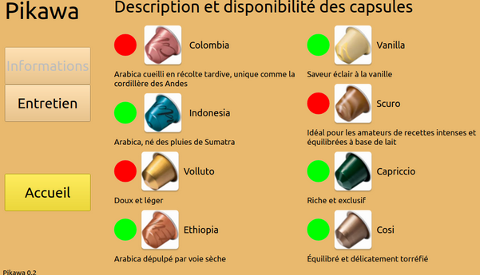
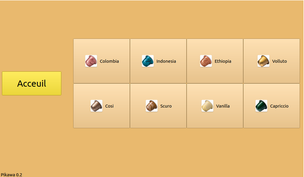
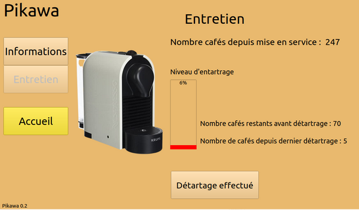

# Le projet pikawa-2022

## Présentation

Pikawa est une machine à café connectée, pilotable grâce à un écran tactile et un logiciel embarqué sur Raspberry Pi.

La cafetière Ekawa est équipée d’un magasin rotatif et motorisé de capsules.

Le logiciel embarqué Pikawa permettra :

* lancer un café personnalisé
* visualiser les alertes (eau, bac à capsule)
* suivre l’entretien

## Analyse de l’existant

L’année 2016 aura marqué l’arrivée de la machine à café automatique connectée, pilotable directement depuis un smartphone et/ou une tablette. 
Pour l'instant, la machine à café connectée reste limitée aux modèles “haut de gamme” à grains.

Exemples : la Delonghi, PrimaDonna Elite, la Saeco Granbaristo Avanti et les Jura Z6, E6 et E8.

Actuellement, il n’existe pas de solutions équivalentes pour des machines à capsules.

## Historique des versions

- Version 0.2 : 25/05/2022
  - lancement de la préparation d'un café personnalisé (type de capsule et longueur)
  - suivi de l'entretien de la machine
  - affichage des alertes (niveau d'eau, bac à capsule, présence tasse et capsule)
  - affichage de la description des capsules

- Version 0.1 : 03/04/2022
  - affichage de l'écran d'accueil et d'informations
  - mise en oeuvre de la recherche d'interfaces Bluetooth
  - squelettes des classes Cafetiere et Preparation

## Captures d'écran

## Auteur

- Anthony Bryckaert <<bryckaert.anthony@gmail.com>>

## Kanban

[pikawa-2022](https://github.com/btssn-lasalle-84/pikawa-2022/projects/1)

## Documentation du code

https://btssn-lasalle-84.github.io/pikawa-2022/
