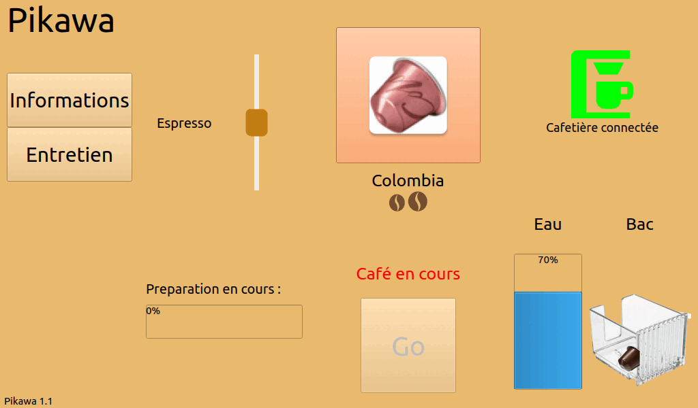

# Le projet pikawa-2022

- [Le projet pikawa-2022](#le-projet-pikawa-2022)
  - [Présentation](#présentation)
  - [Analyse de l’existant](#analyse-de-lexistant)
  - [Historique des versions](#historique-des-versions)
  - [Diaporama](#diaporama)
  - [Configuration du mode kiosque](#configuration-du-mode-kiosque)
  - [Fabrication](#fabrication)
  - [Protocole](#protocole)
  - [Base de données](#base-de-données)
  - [Kanban](#kanban)
  - [Documentation du code](#documentation-du-code)
  - [Auteur](#auteur)

## Présentation

Pikawa est une machine à café connectée, pilotable grâce à un écran tactile et un logiciel embarqué sur Raspberry Pi.

La cafetière Ekawa est équipée d’un magasin rotatif et motorisé de capsules.


Le logiciel embarqué Pikawa permet :

- lancer un café personnalisé
- visualiser les alertes (eau, bac à capsule)
- suivre l’entretien


## Analyse de l’existant

L’année 2016 aura marqué l’arrivée de la machine à café automatique connectée, pilotable directement depuis un smartphone et/ou une tablette. 
Pour l'instant, la machine à café connectée reste limitée aux modèles “haut de gamme” à grains.

Exemples : la Delonghi, PrimaDonna Elite, la Saeco Granbaristo Avanti et les Jura Z6, E6 et E8.

Actuellement, il n’existe pas de solutions équivalentes pour des machines à capsules.

## Historique des versions



- [Version 1.1](https://github.com/btssn-lasalle-84/pikawa-2022/releases/tag/1.1) : 11/06/2022
  - ajout d'une barre de progression
  - gestion de l'erreur capsule

- [Version 1.0](https://github.com/btssn-lasalle-84/pikawa-2022/releases/tag/1.0) : 27/05/2022
  - génération de la documentation du code

- [Version 0.2](https://github.com/btssn-lasalle-84/pikawa-2022/releases/tag/0.2) : 25/05/2022
  - lancement de la préparation d'un café personnalisé (type de capsule et longueur)
  - suivi de l'entretien de la machine
  - affichage des alertes (niveau d'eau, bac à capsule, présence tasse et capsule)
  - affichage de la description des capsules

- [Version 0.1](https://github.com/btssn-lasalle-84/pikawa-2022/releases/tag/0.1) : 03/04/2022
  - affichage de l'écran d'accueil et d'informations
  - mise en oeuvre de la recherche d'interfaces Bluetooth
  - squelettes des classes Cafetiere et Preparation


## Diaporama

- [Oral de revue finale - BRYCKAERT Anthony.pptx](docs/Oral%20de%20revue%20finale%20-%20BRYCKAERT%20Anthony.pptx)

## Configuration du mode kiosque

Modèle : Rapsberry Pi 3B+ sur `Bullseye` (Debian 11)

Désactivation de l'écran de veille

`$ xset s noblank`

Vérifiez si le paramètre est correctement activé :

```
$ xset q
Keyboard Control:
[...]
Screen Saver:
  prefer blanking:  no    allow exposures:  yes
  timeout:  0    cycle:  600
Colors:
[...]
```

Désactivation du curseur :

`$ sudo apt-get install unclutter`

## Fabrication

Clonez le projet :

`$ git clone https://github.com/btssn-lasalle-84/pikawa-2022.git`

Allez dans le dossier du projet :

`$ cd pikawa-2022/pikawa-qt/`

Fabriquez le programme (cette opération peut prendre plusieurs minutes) :

`$ qmake && make`

Puis executez le programme :

`$ ./pikawa-qt`

## Protocole

Document : [protocole-pikawa.pdf](docs/protocole-pikawa.pdf)

## Base de données


## Kanban

[pikawa-2022](https://github.com/btssn-lasalle-84/pikawa-2022/projects/1)

## Documentation du code

https://btssn-lasalle-84.github.io/pikawa-2022/

## Auteur

- Anthony Bryckaert <<bryckaert.anthony@gmail.com>>

©️ LaSalle Avignon 2022
